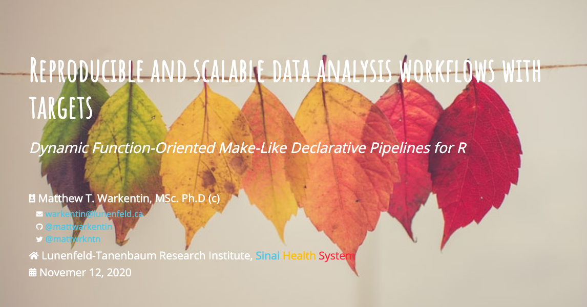

```{r, include = FALSE}
knitr::opts_chunk$set(
  collapse = TRUE,
  comment = "#>"
)
```

# Reproducible and scalable data analysis workflows with targets



### Dynamic Function-Oriented Make-Like Declarative Pipelines for R

__Author__: Matthew T. Warkentin (<warkentin@lunenfeld.ca>)

&#x1F4FA; [__Click to View Slides__](https://mattwarkentin.github.io/targets-demo/)
